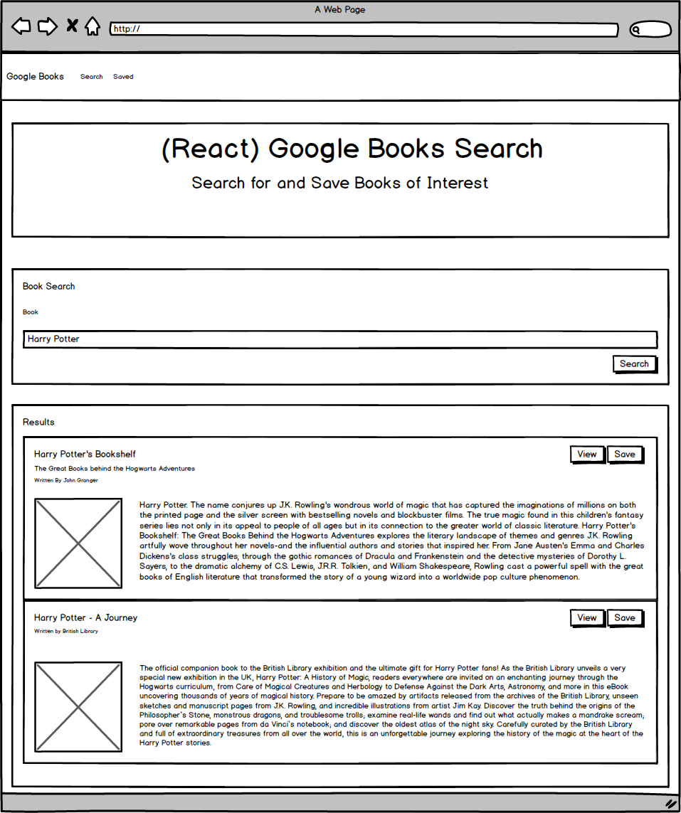

# GT-Homework-21-Google-Books-Search

A Google Books search application to save and search books.


## Description

A React-based Google Books Search app. Application is built with React components, work with helper/util functions, and utilize React lifecycle methods to query and display books based on user searches. Node, Express and MongoDB is used so that users can save books to review or purchase later.

## Table of Contents

* [Installation](#installation)
* [Usage](#usage)
* [Design](#design)
* [Contributing](#contributing)
* [Website](#website)
* [Repository](#repository)
* [Questions](#questions)
* [License](#license)


## Installation

Install the necessary dependencies in the command line with:

```sh
npm install
```

Initialize database seed with:

```sh
npm run seed
```

Start application with:

```sh
npm run seed
```

## Usage

This application features two pages, read the following description for each page:
  
  * Saved - Renders all books saved to the Mongo database. User has an option to "View" the book, bringing them to the book on Google Books, or "Delete" a book, removing it from the Mongo database.

  * Search - User can search for books via the Google Books API and render them here. User has the option to "View" a book, bringing them to the book on Google Books, or "Save" a book, saving it to the Mongo database.

## Design

Below are mockups illustrating the design for each page in the application.

Page - Saved


Page - Search



## Contributing

None.

## Website

[Deployed Application](https://stark-forest-37093.herokuapp.com/)

## Repository

[Github Repository](https://github.com/AlanAshworth/GT-Homework-21-Google-Books-Search)

## Questions


Contact me at <a href="mailto:awashworth927@gmail.com">awashworth927@gmail.com</a>


## License

© 2019 Trilogy Education Services, a 2U, Inc. brand. All Rights Reserved.
